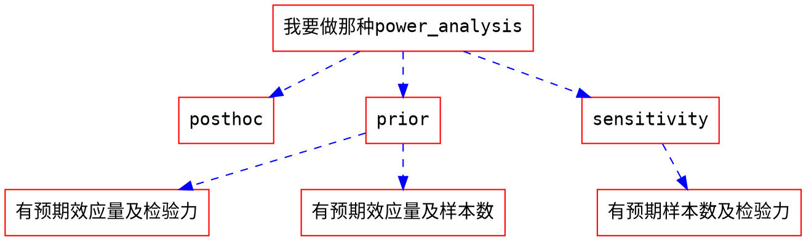

```{r setup, include=FALSE}
knitr::opts_chunk$set(echo = TRUE)
```

# 0 工作起点




# 1 研究设计(依变量类型分类)

- 参考[statkat](https://statkat.com/stattest_overview.php)

<style type="text/css">
.tg  {border-collapse:collapse;border-spacing:0;}
.tg td{font-family:Arial, sans-serif;font-size:14px;padding:10px 5px;border-style:solid;border-width:1px;overflow:hidden;word-break:normal;border-color:black;}
.tg th{font-family:Arial, sans-serif;font-size:14px;font-weight:normal;padding:10px 5px;border-style:solid;border-width:1px;overflow:hidden;word-break:normal;border-color:black;}
.tg .tg-cly1{text-align:left;vertical-align:middle}
.tg .tg-baqh{text-align:center;vertical-align:top}
.tg .tg-nrix{text-align:center;vertical-align:middle}
.tg .tg-0lax{text-align:left;vertical-align:top}
</style>
<table class="tg">
  <tr>
    <th class="tg-cly1"></th>
    <th class="tg-nrix" colspan="5">依变量或第二变量</th>
  </tr>
  <tr>
    <td class="tg-nrix">独变量或第一变量</td>
    <td class="tg-nrix">有两组被试单一类别变量<br></td>
    <td class="tg-nrix">有三组以上被试单一类别变量</td>
    <td class="tg-cly1">第一或第二变量是名义尺度</td>
    <td class="tg-baqh">第一或第二变量是连续尺度</td>
    <td class="tg-baqh">所有变量都是连续尺度</td>
  </tr>
  <tr>
    <td class="tg-0lax">无</td>
    <td class="tg-0lax"></td>
    <td class="tg-0lax"></td>
    <td class="tg-0lax"></td>
    <td class="tg-0lax"></td>
    <td class="tg-0lax"></td>
  </tr>
  <tr>
    <td class="tg-0lax">相依样本<br></td>
    <td class="tg-0lax"></td>
    <td class="tg-0lax"></td>
    <td class="tg-0lax"></td>
    <td class="tg-0lax"></td>
    <td class="tg-0lax"></td>
  </tr>
  <tr>
    <td class="tg-0lax">有两组被试单一类别变量</td>
    <td class="tg-0lax"></td>
    <td class="tg-0lax"></td>
    <td class="tg-0lax"></td>
    <td class="tg-0lax"></td>
    <td class="tg-0lax"></td>
  </tr>
  <tr>
    <td class="tg-0lax">有三组以上被试单一类别变量</td>
    <td class="tg-0lax"></td>
    <td class="tg-0lax"></td>
    <td class="tg-0lax"></td>
    <td class="tg-0lax"></td>
    <td class="tg-0lax"></td>
  </tr>
  <tr>
    <td class="tg-0lax"></td>
    <td class="tg-0lax"></td>
    <td class="tg-0lax"></td>
    <td class="tg-0lax"></td>
    <td class="tg-0lax"></td>
    <td class="tg-0lax"></td>
  </tr>
  <tr>
    <td class="tg-0lax"></td>
    <td class="tg-0lax"></td>
    <td class="tg-0lax"></td>
    <td class="tg-0lax"></td>
    <td class="tg-0lax"></td>
    <td class="tg-0lax"></td>
  </tr>
  <tr>
    <td class="tg-0lax"></td>
    <td class="tg-0lax"></td>
    <td class="tg-0lax"></td>
    <td class="tg-0lax"></td>
    <td class="tg-0lax"></td>
    <td class="tg-0lax"></td>
  </tr>
  <tr>
    <td class="tg-0lax"></td>
    <td class="tg-0lax"></td>
    <td class="tg-0lax"></td>
    <td class="tg-0lax"></td>
    <td class="tg-0lax"></td>
    <td class="tg-0lax"></td>
  </tr>
  <tr>
    <td class="tg-0lax"></td>
    <td class="tg-0lax"></td>
    <td class="tg-0lax"></td>
    <td class="tg-0lax"></td>
    <td class="tg-0lax"></td>
    <td class="tg-0lax"></td>
  </tr>
  <tr>
    <td class="tg-0lax"></td>
    <td class="tg-0lax"></td>
    <td class="tg-0lax"></td>
    <td class="tg-0lax"></td>
    <td class="tg-0lax"></td>
    <td class="tg-0lax"></td>
  </tr>
  <tr>
    <td class="tg-0lax"></td>
    <td class="tg-0lax"></td>
    <td class="tg-0lax"></td>
    <td class="tg-0lax"></td>
    <td class="tg-0lax"></td>
    <td class="tg-0lax"></td>
  </tr>
  <tr>
    <td class="tg-0lax"></td>
    <td class="tg-0lax"></td>
    <td class="tg-0lax"></td>
    <td class="tg-0lax"></td>
    <td class="tg-0lax"></td>
    <td class="tg-0lax"></td>
  </tr>
  <tr>
    <td class="tg-0lax"></td>
    <td class="tg-0lax"></td>
    <td class="tg-0lax"></td>
    <td class="tg-0lax"></td>
    <td class="tg-0lax"></td>
    <td class="tg-0lax"></td>
  </tr>
  <tr>
    <td class="tg-0lax"></td>
    <td class="tg-0lax"></td>
    <td class="tg-0lax"></td>
    <td class="tg-0lax"></td>
    <td class="tg-0lax"></td>
    <td class="tg-0lax"></td>
  </tr>
</table>

# 2 可用软件


## 2.1 G*Power


## 2.2 jPower


## 2.3 ANOVAPower

ANOVApower 的目的是帮助研究者容易简便地模拟 ANOVA 实验设计，并且可以计算相应的统计检验力。

### 2.3.1 ANOVApower R 包的安装

在 R 中运行

```{r}
# devtools::install_github("Lakens/ANOVApower") (先注释掉了，如有需要请运行)
```


（如果尚未安装 devtools，请先在 Packages 中安装）

### 2.3.2 ANOVA_design 函数

使用 ANOVApower 这个 R 包，需要在 ANOVA_design 这个函数中设定相关的参数。目前，ANOVA_design 这个函数可以用来构建包含**最多3个因素**的实验设计，包括被试内、被试间和混合实验设计。在构建的过程中，需要设定 design, n, mu, sd, r 和 labelnames 这几个参数，其中labelnames 是非强制设定的参数。

参数具体含义如下：

1. design：用字符串来指出你所构建的实验设计（见下）
2. n：每个被试间条件下的样本量
3. mu：每一个条件下的均值
4. sd：总体标准差，假设满足方差齐性的假设（只能设定一个标准差的值）
5. r：被试内设计中的相关（被试间为 0）
6. labelnames：非强制设定参数，用来表示因素名称和因素水平名称（见下）
7. 最后一个可选设定项为是否输出图表（plot = TRUE or FALSE)

####  2.3.2.1 design：用字符串来指出你所构建的实验设计
1. 每一个因素用一个数字和一个字母来表示。数字代表这个因素拥有的水平的个数，字母代表这个因素是被试间因素还是被试内因素。
2. 举例：

```
2b 实验设计代表在这个实验中有1个被试间因素，这个因素有2个组别

12w 实验设计代表一个被试内因素有12个水平

2b*3w 实验设计代表有两个因素，一个因素为被试间因素(例如药片)，有2个组别(例如，一组为药物，另外一组为安慰剂)，另外一个因素为被试内因素(例如被试健康程度)，有3个水平(例如，分别在服用药片前、服用药片后一天和服用药片后一周测量)

注：ANOVApower 可最多包含3个因素，用*号隔开
```

#### 2.3.2.2 mu：每一个条件下的均值
1. 在 2b*3w 例子中，有 6 种不同的条件，所以需要设定 6 个均值。例如，

|       | 服用药片前| 服用药片后一天| 服用药片后一周|
|:-----:|:---------:|:-------------:|:-------------:|
| 药物  |           |               |               |
| 安慰剂|           |               |               |


2. 均值需要以正确的顺序输入。在 ANOVA_design 的输出中包括了一个图，你可以用这个图来检查输入的每组的均值是否正确。
3. 一般的规则为使用程序代码来形成因素，由labelnames（见下）中输入的因素名称表示，例如condition和time。因素的水平由因素的名称和水平来共同表示，例如 drug_time1, drug_time2, drug_time3, control_time1, control_time2, and control_time3。
4. 如果你的实验设计中只有一个因素，你只需按照在labelnames（见下）中同样的顺序输入对应的均值。如果你的实验设计中有多个因素，通常设置如下例所示：

```
如果实验设计中有三个因素，而每个因素都有两个水平，顺序如下：
1. a1b1c1
2. a1b1c2
3. a1b2c1
4. a1b2c2
5. a2b1c1
6. a2b1c2
7. a2b2c1
8. a2b2c2
如果这8个均值分别为 mu = c(1, 2, 3, 4, 5, 6, 7, 8)，则如下图所示：
```


(来自 [https://raw.githubusercontent.com/Lakens/ANOVApower/master/README_files/figure-gfm/unnamed-chunk-1-1.png](https://raw.githubusercontent.com/Lakens/ANOVApower/master/README_files/figure-gfm/unnamed-chunk-1-1.png))

#### 2.3.2.3 labelnames：非强制设定参数，用来表示因素名称和因素水平名称
1. 为因素和水平命名可以提高模拟结果的图表的易读性
2. 举例，上文提到的 2*3 实验设计的相应代码为：

```
c("condition", "placebo", "medicine", "time", "time1", "time2", "time3")
# 首先写一个因素的名称，其后写该因素的不同水平；然后写另外一个因素的名称，其后写该因素的不同水平
# 注意：因素名称或水平中不要包含空格
```

3. 其它例子：
```
c("time", "morning", "evening") # 一个被试内因素(time, 2 水平)，2w
c("time", "morning", "evening", "group", "control", "experimental") # 两个被试间因素(time 和 group，分别包含 2 水平)， 2b*2b
c("time", "morning", "afternoon", "evening", "night", "group", "control", "experimental") # 两个被试间因素(time 和 group，第一个有 4 个水平，第二个有 2 个水平)，4b*2b
```
#### 2.3.2.4 r：被试内设计中的相关（被试间为 0）
1. 根据实验的因素是被试内因素还是被试间因素，我们需要决定变量之间是否相关及相关程度。例如，我们可以设定被试内因素之间的相关程度，既可以假设所有的被试内因素之间的相关程度相等（例如 r = 0.7），也可以借助相关矩阵设定每一对之间的相关性
2. 假设在一个 2\*2 被试内实验设计中，有两个被试内因素 A 和 B，每一个因素有 2 个水平，所有会有 6 组相关的数值需要设定；如果实验设计为 2\*2\*4 被试内实验设计，则有120组相关的数值需要设定
3. ANOVApower 的优势：大部分的统计检验力分析的工具都只能包含一个重复测量的因素 (Potvin & Schutz, 2000)，而 ANOVApower可以包含最多 3 个；还有一些统计检验力分析工具只能将被试内因素及不同水平间的相关设置为同样的数值，而 ANOVApower 可以借助相关矩阵来设定每一组的数值
4. 相关数值的设定顺序，例如在 2*2 的被试内实验设计中，我们需要设定6个相关数值：

| 因素    | a1_b1  | a1_b2  | a2_b1  | a2_b2  |
|:-------:|:------:|:------:|:------:|:------:|
| a1_b1   | 1.00   | 0.91   | 0.92   | 0.93   |
| a1_b2   | 0.91   | 1.00   | 0.94   | 0.95   |
| a2_b1   | 0.92   | 0.94   | 1.00   | 0.96   |
| a2_b2   | 0.93   | 0.95   | 0.96   | 1.00   |

然后使用自上向下、自左向右的顺序在代码中输入以上数值：
```{r}
library(ANOVApower)
design_result <- ANOVA_design(design = "2w*2w",
                              n = 80,
                              mu = c(1.1, 1.2, 1.3, 1.4),
                              sd = 2,
                              r <- c(.91, .92, .93, .94, .95, .96))
                              # 顺序是 a1_b1, a1
```


我们可以通过检查由design_result得到的相关矩阵来检验我们的输入是否正确：

```{r}
design_result$cor_mat
```


并且由此可以看出，我们并没有设定这些labelnames,他们是由程序自动设定的。

#### 2.3.2.5 设定样本量

你可以通过赋值给`n`来为每种实验条件设定样本量。此举的假设为你可以针对每种不同的实验条件来收集到相等的样本量。【在未来的ANOVApower中会加入可为不同实验条件设定不同的样本量的功能】

#### 2.3.2.6 设定标准差

你可以通过赋值给`sd`来设定标准差的值。当前ANOVApower只允许在满足方差齐性的假设（即在不同的实验条件下标准差相同）下来计算。需要注意的是在你计划做一个研究的时候，针对你所预测的变量的值，总会出现一些不确定性。因此，sensitivity analyses是非常有帮助的（例如在使用预期的标准差的值来做仿真模拟，但是使用更保守或者最坏情况下的值的时候）。

### 2.3.3 基于仿真模拟的统计检验力计算

基于仿真模拟，计算ANOVA设计的统计检验力有两种不同的方法。第一种方法为基于平均数、样本量、标准差和相关系数，在特定的统计假设下（例如正态分布的数据）针对每一种实验情况重复模拟数据。ANOVA_power函数允许基于重复模拟正态分布的数据来进行统计检验力分析。第二种方法为模拟一个拥有*十分精确的*、具有所期望的特征的数据集 - 每一个设计的单元都有n个具有我们想要的均值、标准差和组间相关系数（针对被试内设计）的数据点。通过对此数据集执行ANOVA，我们可以计算用来做统计检验力分析所需要的统计量。ANOVA_exact函数允许你基于此方法来计算统计检验力。相比而言，ANOVA_power函数更加地灵活（例如我们可以用不同的方法来纠正多重检验，或者在以后的版本中会增加允许你进行模拟更接近现实的不为正态分布的数据集的功能），但是ANOVA_exact函数速度更快（只需数秒，而不像其他大型的模拟需要数分钟或数小时）。

### 2.3.4 ANOVA_power函数

ANOVA_power函数从ANOVA_design函数中获取结果，然后在特定的alpha水平下来模拟`nsims`次数据。在结果中会呈现ANOVA结果的表格和所有独立比较的结果。

需要如下输入：

1. design_result: ANOVA_design函数的输出结果被保存作为一个目标
2. alpha_level: alpha水平用来设定统计显著性水平
3. p_adjust: 使用`p.ajust`函数来对多重比较做出修正
4. nsims: 执行的模拟的次数
5. seed: 为可重复性结果设定seed
6. verbose: 如果不打印结果则设定为FALSE，默认值为TRUE

模拟通常会花费一段时间。更多次数的模拟会使我们得到更为精确的结果，但也需花费更长的时间。我们建议将测试设定正确与否的模拟次数设为100次，如果设定正确就将模拟次数设置为1000次（或者10000次，如果你要去喝杯咖啡；或者100000次，如果你需要小数点后更为精确的数值;))

### 2.3.5 ANOVA_exact函数

ANOVA_exact函数从ANOVA_design函数中引入结果，并且模拟一个可精确匹配所需要的特征的数据集（使用`MASS`包中的`mvrnorm`函数，设定为`empirical = TRUE`）。这个数据集可以用来执行单个的ANOVA，并且结果可以用计算统计检验力（感谢Chris Aberson为此方法提供了灵感）。

ANOVA_exact需要如下输入：ANOVA_design, alpha_level和verbose。

1. design_result: 将ANOVA_design的输出结果保存为一个目标
2. alpha_level: alpha水平用来设定统计显著性水平
3. verbose：如果不打印结果则设定为FALSE，默认值为TRUE

与ANOVA_power函数相比，ANOVA_exact的方法要快很多（只需模拟一个单个的数据集）。当前唯一的不同是ANOVA_exact不允许你来检验纠正多重比较的结果（没有`p_adjust`的选项），并且ANOVA_exact不适用与样本量小于8的情况（因为针对特别小的样本量，模拟一个拥有所需要的特征的数据集几乎不可能）。

#### 2.3.5.1 例子

假如你现在计划执行一个研究，在这个研究中，被试与人工语音助手进行互动。人工语音助手拥有两个变量 - 声音（听起来像人类 vs 听起来像机器人）和情绪（高兴 vs 沮丧）。在如下例子中，为这个2*2的混合实验设计来执行1000次模拟（声音为被试间变量，情绪为被试内变量）。在每个被试间的实验条件下，样本量为40，所以总被试量为80。假设总体标准差为1.03，被试内因素之间的相关为0.8，平均数分别为1.03，1.21，0.98和1.01。没有针对多重比较做出修正。在模拟中使用的alpha水平为0.01。

```{r}
design_result <- ANOVA_design(design = "2b*2w",
                   n = 40, 
                   mu = c(1.03, 1.41, 0.98, 1.01), 
                   sd = 1.03, 
                   r=0.8, 
                   labelnames = c("voice", "human", "robot", "emotion", "cheerful", "sad"))
```

```{r}
nsims <- 1000 # 注：此处根据实际需要修改，例如上文提到的先设定成100，如果正确的话再修改为1000
power_result_vig_1 <- ANOVA_power(design_result, 
                                   alpha = 0.05, 
                                   nsims = nsims, 
                                   seed = 1234)
```

```{r}
# reduce file size for github - only save what is needed
power_result_vig_1$sim_data <- NULL
#power_result_vig_1$plot1 <- NULL
power_result_vig_1$plot2 <- NULL
# 根据实际需要进行修改
```


```{r}
saveRDS(power_result_vig_1, file = "D:/temp/power_result_vig_1.rds")
power_result_vig_1 <- readRDS(file = "D:/temp/power_result_vig_1.rds")
#根据实际需要修改路径
```


```{r}
power_result_vig_1$plot1
```


统计检验力模拟的结果输出如上。结果主要分为2个部分（可以通过将verbose设定为FALSE将结果压缩显示）。第一个表格提供了ANOVA的统计检验力（从0到100%）和效应量（partial eta-squared）。我们可以看到针对声音、情绪和声音*情绪的主效应的结果。

统计检验力模拟的结果显示情绪的主效应的统计检验力最高。因为情绪是被试内因素,并且平均数高度相关（0.8），所以针对被试内的对比，我们拥有较高的统计检验力。针对交互作用，统计检验力较低，并且声音的主效应非常低。

ANOVA通常的后续为事后比较。统计假设通常不只预测交互作用存在，还预测交互作用的方向。如上图所示，我们可能只对高兴和悲伤的类人声声音助理的独立效应和悲伤的类机器人和类人的声音的差异感兴趣。第二个表格显示了针对所有事后比较的*t*检验的统计检验力和效应量（针对被试间对比为Cohen's d，针对被试内对比为Cohen's $d_z$，针对被试内对比，见Lakens, 2013）。

通常针对被试内因素，不同实验条件下的差异的统计检验力比较高， 而对于相似的平均数（例如，1.03，0.98和1.01）之间的微小差异的统计检验力非常低。除以上两个表格之外，ANOVA_power函数可以返回初始的模拟数据（针对每一个模拟的*p*值和效应量，见simulation_result$sim_data）和包含所有ANOVA检验中的*p*值分布的图表。

### 2.3.5.2 两组 One-Way ANOVA的统计检验力

假设我们计划设计一个研究来检验如下假设：照顾宠物可以提升人们的生活满意度。我们有一个控制组和一个实验组（被试有一个需要照顾的宠物），将被试随机分配到这两种组别中。我们可以模拟一个设定了alpha，样本量和效应量的One-Way ANOVA，来计算相应的统计检验力。我们预期相比于控制组，实验组中的宠物可以提升被试的生活满意度。基于Pavot和Diener（1993）的工作成果，我们相信在总体中针对生活满意度的测量均值约为24，标准差约为6.4。我们期望针对拥有宠物的被试，宠物约可以提升2.2的生活满意度分数。我们计划一共收集200个被试的数据，每一个实验条件下随机分配100名被试。我们通过如下步骤来检验这个实验设计的统计检验力：


```{r}
design <- "2b"
n <- 100
mu <- c(24, 26.2)
sd <- 6.4
labelnames <- c("condition", "control", "pet") #

design_result <- ANOVA_design(design = design,
                              n = n,
                              mu = mu, 
                              sd = sd, 
                              labelnames = labelnames)
```


```{r}
nsims <- 1000 # 注：此处根据实际需要修改，例如上文提到的先设定成100，如果正确的话再修改为1000

power_result_vig_2 <- ANOVA_power(design_result, nsims = nsims, seed = 1234)
# 
# reduce file size for github - only save what is needed
power_result_vig_2$sim_data <- NULL
# power_result_vig_2$plot1 <- NULL
power_result_vig_2$plot2 <- NULL
saveRDS(power_result_vig_2, file = "D:/temp/power_result_vig_2.rds")
power_result_vig_2 <- readRDS(file = "D:/temp/power_result_vig_2.rds")

#Note we do not specify any correlation in the ANOVA_design function (default r = 0), nor do we specify an alpha in the ANOVA_power function (default is 0.05)
```
结果显示针对ANOVA，我们有和*t*检验一样的统计检验力结果，原因是在这个例子中只有2组被试。在这个研究中，每一组有100名被试，相应的统计检验力相对来说很低（在67.7%左右）。

只有两组被试的ANOVA和*t*检验是一样的，在上述例子中，针对控制组和实验组差异的Cohen's d（标准均差）是d = 2.2/6.4 = 0.34375，可以很容易地通过`pwr`包来计算简单比较的预期的统计检验力。

```{r}
library(pwr)
pwr.t.test(d = 2.2/6.4,
           n = 100,
           sig.level = 0.05,
           type="two.sample",
           alternative="two.sided")$power
```

我们也可以通过两个组别的Cohen's d来直接计算Cohen's f，正如Cohen（1988）所描述，$f = \frac{1}{2}d$。所以$f = 0.5*0.34375 = 0.171875$。事实上，使用`pwr`包中`pwr.anova.test`所计算的统计检验力与`power.t.test`结果一致。

```{r}
pwr.anova.test(n = 100,
               k = 2,
               f = 0.171875,
               sig.level = 0.05)$power
```

以上分析表明使用每组包含100名被试的实验设定不太会导致显著的统计结果，即使我们所期望的差异是真实存在的。这显然不是最优的结果。如果我们进行一项研究，我们希望可以得到信息丰富的结果，也就是说如果效应存在，我们就应该可以探测到所期望的或者所关心的这个效应；如果效应不存在，我们就应该探测不到这个效应。

如果想达到足够的统计检验力，我们究竟需要多少被试呢？考虑到预期的差异和标准差，d = 0.34375，f = 0.171875。我们可以增大样本量进而进行模拟，直到满意为止。统计检验力与二型错误的概率密切相关。Cohen建议将所寻求的统计检验力的标准设为80%，即二型错误的概率为20%。我个人认为20%的二型错误概率太高，并且与设定地更加严格地一型错误概率（尽管你可以调整alpha，但通常设定为5%）相比并不相称。假设我们在这里想达到90%的统计检验力。

当你在增加样本量来找出究竟实验设计中需要多少被试的时候，使用`ANOVA_exact`函数更为有效率。你可以看到在如下代码中我们慢慢地增加样本量，发现180个被试时可达到略高于90%的统计检验力。

```{r}
design_result <- ANOVA_design(design = "2b",
                   n = 100, 
                   mu = c(24, 26.2), 
                   sd = 6.4, 
                   labelnames = c("condition", "control", "pet"))
```

```{r}
ANOVA_exact(design_result)$main_results$power
```

统计检验力为67.7%，此结果较低，因此我们将样本量从每组100人升至150人来看结果是否更接近我们的目标 - 统计检验力达到90%。

```{r}
design_result <- ANOVA_design(design = "2b",
                   n = 150, 
                   mu = c(24, 26.2), 
                   sd = 6.4, 
                   labelnames = c("condition", "control", "pet"),
                   plot = FALSE)

ANOVA_exact(design_result)$main_results$power
```


此次统计检验力达到84.31%，但仍然不够，我们试一下每组175人。

```{r}
design_result <- ANOVA_design(design = "2b",
                   n = 175, 
                   mu = c(24, 26.2), 
                   sd = 6.4, 
                   labelnames = c("condition", "control", "pet"),
                   plot = FALSE)

ANOVA_exact(design_result)$main_results$power
```

结果为89.37%，非常接近我们的目标，因此再稍添一些被试，我们来试一下每组180人的情况。

```{r}
design_result <- ANOVA_design(design = "2b",
                   n = 180, 
                   mu = c(24, 26.2), 
                   sd = 6.4, 
                   labelnames = c("condition", "control", "pet"),
                   plot = FALSE)

ANOVA_exact(design_result)$main_results$power
```

此次的结果为90.19%。

#### 2.3.5.3 Plot_power函数

基于模拟的统计检验力分析需要你来增加样本量，直到统计检验力足够高来达到你想要的二型错误率。为加速这个过程，我们可以使用`plot_power`函数来画出随着样本量的变化，统计检验力随之变化的曲线。

`plot_power`这个函数需要如下输入：ANOVA_design, max_n和plot。

1. design_result：由`ANOVA_design`函数得到的输出（保存为一个对象）
2. min_n：统计检验力曲线中的最小样本量
3. max_n：统计检验力曲线中的最大样本量
4. plot: 如果不输出图像，则设定为FALSE（默认值为TRUE）

`plot_power`函数可以使用`ANOVA_exact`函数来模拟直至`max_n`样本量的统计检验力。即使这种方法速度稍快，当样本量较大时还是需要不少时间来得出结果。如下图所示，我们可以看出，假设平均数和标准差真正的模式可代表我们所期望的平均数和标准差的模式，在每组有135名被试的情况下，我们可以得到约80%的统计检验力;在每组有180名被试的情况下，我们可以得到约90%的统计检验力；在每组有225名被试的情况下，我们可以得到约95%的统计检验力。

```{r}
plot_power(design_result, min_n = 10, max_n = 250)
```

由于平均数的真正的模式是不知道的，检验一定范围内的统计检验力是非常明智的。举例来说，假如平均数之间的差别非常小（假如平均数分别为24和26，而不是24和26.2），我们可以将上图中的统计检验力曲线和此略不乐观情况下（真正的效应量稍小）的统计检验力曲线进行对比。

```{r}
design_result <- ANOVA_design(design = "2b",
                   n = 180, 
                   mu = c(24, 26), 
                   sd = 6.4, 
                   labelnames = c("condition", "control", "pet"),
                   plot = FALSE)

plot_power(design_result, max_n = 250)
```

除效应量可能较小之外，标准差也可能比我们所期望的稍大。这也会进一步降低统计检验力，并且这比上面提到的情况更为不理想。我们假设真正的标准差为6.8而不是6.4。

```{r}
design_result <- ANOVA_design(design = "2b",
                   n = 180, 
                   mu = c(24, 26), 
                   sd = 6.8, 
                   labelnames = c("condition", "control", "pet"),
                   plot = FALSE)

plot_power(design_result, min_n = 10, max_n = 250)
```

就像这些不同的图像所示，你的研究永远不可能真正地知道统计检验力。因为真正的效应量（例如，平均数和标准差的模式）未知，那么真正的统计检验力也是未知的。假设在一个特定的效应量的值下，一个研究可达到90%的统计检验力，但是如果真正的效应量与你所期望的数值不同，那么真正的统计检验力就会较高或较低。因此，当执行先验统计检验力分析时，我们应该讨论的是“期望的”统计检验力，并且应该为我们的期望提供证据（例如，被试内设计的平均数、标准差和相关的模式）。

#### 2.3.5.4 三组被试间设计的统计检验力

假如我们计划设计一项研究来检验如下假设：照顾宠物可以提升人们的生活满意度。我们有一个控制组、一个宠物为猫的实验组和一个宠物为狗的实验组。我们可以模拟一个拥有设定的alpha、样本量和效应量的One-Way ANOVA来计算ANOVA和相应的事后比较的统计检验力。我们假设和控制组相比，所有的拥有宠物组都可以提升生活满意度。并且，我们假设养狗的被试比养猫的被试的生活满意度要高。基于Pavot和Diener（1993）的研究成果，我们再一次假设在总体中针对生活满意度的测量均值约为24，标准差约为6.4。我们期望猫作为宠物可提升生活满意度约2.2个点，狗作为宠物可提升生活满意度约2.6个点。作为开始，我们收集150名被试的数据，每组50人。但是在收集数据之前，我们先计算统计检验力来看是否可以检验到我们所期望的差异。

```{r}
design <- "3b"
n <- 50
mu <- c(24, 26.2, 26.6)
sd <- 6.4
labelnames <- c("condition", "control", "cat", "dog") #

design_result <- ANOVA_design(design = design,
                   n = n, 
                   mu = mu, 
                   sd = sd, 
                   labelnames = labelnames)
```

```{r}
ANOVA_exact(design_result)
```

结果显示，当每组有50个被试时，不论是总体的ANOVA（略低于50%）还是事后比较（控制组对比养猫组约为40%，控制组对比养狗组约为50%，养猫组和养狗组之间的差异的统计检验力极低，约为6%，只比一型错误率5%高一点点）统计检验力很低。我们可以很容易地使用`pwr`包来确认针对这些简单比较所期望的统计检验力。在我们的例子中，控制组和养猫组之间的差异的Cohen's d（标准均差）是$2.2/6.4 = 0.34375$，控制组和养狗组之间的差异的Cohen's d是$2.6/6.4 = 0.40625$，养猫组和养狗组之间的差异的Cohen's d是$0.4/6.4 = 0.0625$

```{r}
pwr.t.test(d = 2.2/6.4,
           n = 50,
           sig.level = 0.05,
           type="two.sample",
           alternative="two.sided")$power
```

```{r}
pwr.t.test(d = 2.6/6.4,
           n = 50,
           sig.level = 0.05,
           type="two.sample",
           alternative="two.sided")$power
```

```{r}
pwr.t.test(d = 0.4/6.4,
           n = 50,
           sig.level = 0.05,
           type="two.sample",
           alternative="two.sided")$power
```

很显然，我们需要更多的被试来提高统计检验力。让我们来画一个统计检验力随着样本量变化的曲线来看我们要增加多少样本。

```{r}
plot_power(design_result, min_n = 10, max_n = 250)
```

我们可以看出在拥有134名被试时，针对ANOVA我们可以得到约90%的统计检验力。但是我们也需要检查针对控制组和养猫组的比较的统计检验力。

```{r}
design <- "3b"
n <- 134
mu <- c(24, 26.2, 26.6)
sd <- 6.4
labelnames <- c("condition", "control", "cat", "dog") #

design_result <- ANOVA_design(design = design,
                   n = n, 
                   mu = mu, 
                   sd = sd, 
                   labelnames = labelnames,
                   plot = FALSE) #do not print the plot (same as above)

ANOVA_exact(design_result)
```

```{r}
n <- 180
design_result <- ANOVA_design(design = design,
                   n = n, 
                   mu = mu, 
                   sd = sd, 
                   labelnames = labelnames,
                   plot = FALSE) #do not print the plot (same as above)

ANOVA_exact(design_result)
```

```{r}
n <- 5380
design_result <- ANOVA_design(design = design,
                   n = n, 
                   mu = mu, 
                   sd = sd, 
                   labelnames = labelnames,
                   plot = FALSE) #do not print the plot (same as above)

ANOVA_exact(design_result)
```

当每组有134名被试时，控制组和养猫组的简单比较的统计检验力只有80%。如果我们针对事后比较都想达到90%的统计检验力，我们需要更多的被试。180名被试可以为控制组和养猫组的事后比较提供较好的统计检验力。但是养猫组和养狗组之间差异的统计检验力极低。我们需要5380名被试来使得此事后比较组达到90%的统计检验力。如果收集数据很容易，那么达到5380名被试是可能的。但是如果数据收集的代价非常高，就使得我们不可能真正得到这个问题的可靠答案。明白不可能可靠地研究一个问题是分析先验统计检验力非常重要的一个方面。

#### 2.3.5.5 重复测量ANOVA的统计检验力

在重复测量设计中，多次的测量数据是从相同的被试来收集的。最简单的情境为有两个重复测量的数据，那么重复测量ANOVA等同于非独立样本或配对样本*t*检验。让我们来看一下此中相关对于重复测量ANOVA的统计检验力的影响。

##### 2.3.5.5.1 样本内的两次测量的情况

为解释相关观测的影响，我们由非独立（或配对、或被试内）*t*检验的中等效应量开始来模拟数据。我们首先来看G\*Power。假如我们想执行一个先验统计检验力分析，我们需要先提供效应量*d_Z*。正如Cohen（1988）所写，
> 下角标Z是用来强调的初始数据的单位不再是X或者Y而是Z的事实

Z是X-Y的差异数。


(来自 [https://github.com/Lakens/ANOVApower/raw/master/vignettes/screenshots/gpower_9.png](https://github.com/Lakens/ANOVApower/raw/master/vignettes/screenshots/gpower_9.png))

因为数据之间是相关的，被试内设计比被试间设计在探测差异时拥有更高的统计检验力，并且因为每一个被试可提供多次观测数据，被试内设计需要更少的被试。独立样本*t*检验和非独立样本*t*检验的一个区别就是独立样本*t*检验的自由度为$2(n-1)$，而非独立样本*t*检验的自由度为$(n-1)$。假设正态分布且忽视两种检验类型在自由度上的不同，两组被试内设计（NW）的样本量相对于两组被试间设计（NB）的样本量为（由Maxwell和Delaney，2004，561页，公式45）：

$$N_W = \frac{N_B(1-\rho)}{2}$$

在公式中，除以2是因为


## 2.4 PANGEA


## 2.5 LMM Power


## 2.6 power analysis in fMRI


## 2.7 Bayesian power analysis 


