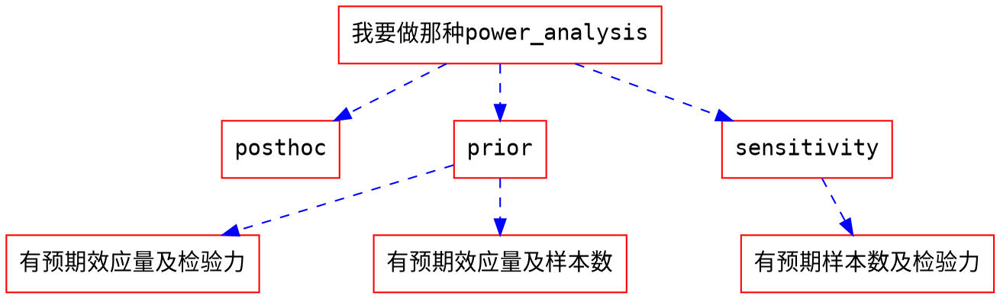

```{r setup, include=FALSE}
knitr::opts_chunk$set(echo = TRUE)
```

# 0 工作起点




# 1 研究设计(依变量类型分类)

- 参考[statkat](https://statkat.com/stattest_overview.php)

<style type="text/css">
.tg  {border-collapse:collapse;border-spacing:0;}
.tg td{font-family:Arial, sans-serif;font-size:14px;padding:10px 5px;border-style:solid;border-width:1px;overflow:hidden;word-break:normal;border-color:black;}
.tg th{font-family:Arial, sans-serif;font-size:14px;font-weight:normal;padding:10px 5px;border-style:solid;border-width:1px;overflow:hidden;word-break:normal;border-color:black;}
.tg .tg-cly1{text-align:left;vertical-align:middle}
.tg .tg-baqh{text-align:center;vertical-align:top}
.tg .tg-nrix{text-align:center;vertical-align:middle}
.tg .tg-0lax{text-align:left;vertical-align:top}
</style>
<table class="tg">
  <tr>
    <th class="tg-cly1"></th>
    <th class="tg-nrix" colspan="5">依变量或第二变量</th>
  </tr>
  <tr>
    <td class="tg-nrix">独变量或第一变量</td>
    <td class="tg-nrix">有两组被试单一类别变量<br></td>
    <td class="tg-nrix">有三组以上被试单一类别变量</td>
    <td class="tg-cly1">第一或第二变量是名义尺度</td>
    <td class="tg-baqh">第一或第二变量是连续尺度</td>
    <td class="tg-baqh">所有变量都是连续尺度</td>
  </tr>
  <tr>
    <td class="tg-0lax">无</td>
    <td class="tg-0lax"></td>
    <td class="tg-0lax"></td>
    <td class="tg-0lax"></td>
    <td class="tg-0lax"></td>
    <td class="tg-0lax"></td>
  </tr>
  <tr>
    <td class="tg-0lax">相依样本<br></td>
    <td class="tg-0lax"></td>
    <td class="tg-0lax"></td>
    <td class="tg-0lax"></td>
    <td class="tg-0lax"></td>
    <td class="tg-0lax"></td>
  </tr>
  <tr>
    <td class="tg-0lax">有两组被试单一类别变量</td>
    <td class="tg-0lax"></td>
    <td class="tg-0lax"></td>
    <td class="tg-0lax"></td>
    <td class="tg-0lax"></td>
    <td class="tg-0lax"></td>
  </tr>
  <tr>
    <td class="tg-0lax">有三组以上被试单一类别变量</td>
    <td class="tg-0lax"></td>
    <td class="tg-0lax"></td>
    <td class="tg-0lax"></td>
    <td class="tg-0lax"></td>
    <td class="tg-0lax"></td>
  </tr>
  <tr>
    <td class="tg-0lax"></td>
    <td class="tg-0lax"></td>
    <td class="tg-0lax"></td>
    <td class="tg-0lax"></td>
    <td class="tg-0lax"></td>
    <td class="tg-0lax"></td>
  </tr>
  <tr>
    <td class="tg-0lax"></td>
    <td class="tg-0lax"></td>
    <td class="tg-0lax"></td>
    <td class="tg-0lax"></td>
    <td class="tg-0lax"></td>
    <td class="tg-0lax"></td>
  </tr>
  <tr>
    <td class="tg-0lax"></td>
    <td class="tg-0lax"></td>
    <td class="tg-0lax"></td>
    <td class="tg-0lax"></td>
    <td class="tg-0lax"></td>
    <td class="tg-0lax"></td>
  </tr>
  <tr>
    <td class="tg-0lax"></td>
    <td class="tg-0lax"></td>
    <td class="tg-0lax"></td>
    <td class="tg-0lax"></td>
    <td class="tg-0lax"></td>
    <td class="tg-0lax"></td>
  </tr>
  <tr>
    <td class="tg-0lax"></td>
    <td class="tg-0lax"></td>
    <td class="tg-0lax"></td>
    <td class="tg-0lax"></td>
    <td class="tg-0lax"></td>
    <td class="tg-0lax"></td>
  </tr>
  <tr>
    <td class="tg-0lax"></td>
    <td class="tg-0lax"></td>
    <td class="tg-0lax"></td>
    <td class="tg-0lax"></td>
    <td class="tg-0lax"></td>
    <td class="tg-0lax"></td>
  </tr>
  <tr>
    <td class="tg-0lax"></td>
    <td class="tg-0lax"></td>
    <td class="tg-0lax"></td>
    <td class="tg-0lax"></td>
    <td class="tg-0lax"></td>
    <td class="tg-0lax"></td>
  </tr>
  <tr>
    <td class="tg-0lax"></td>
    <td class="tg-0lax"></td>
    <td class="tg-0lax"></td>
    <td class="tg-0lax"></td>
    <td class="tg-0lax"></td>
    <td class="tg-0lax"></td>
  </tr>
  <tr>
    <td class="tg-0lax"></td>
    <td class="tg-0lax"></td>
    <td class="tg-0lax"></td>
    <td class="tg-0lax"></td>
    <td class="tg-0lax"></td>
    <td class="tg-0lax"></td>
  </tr>
  <tr>
    <td class="tg-0lax"></td>
    <td class="tg-0lax"></td>
    <td class="tg-0lax"></td>
    <td class="tg-0lax"></td>
    <td class="tg-0lax"></td>
    <td class="tg-0lax"></td>
  </tr>
</table>

# 2 可用软件


## 2.1 G*Power


## 2.2 jPower


## 2.3 ANOVAPower

ANOVApower 的目的是帮助研究者容易简便地模拟 ANOVA 实验设计，并且可以计算相应的统计检验力。

### 2.3.1 ANOVApower R 包的安装

在 R 中运行

```{r}
# devtools::install_github("Lakens/ANOVApower") (先注释掉了，如有需要请运行)
```


（如果尚未安装 devtools，请先在 Package 中安装）

### 2.3.2 ANOVA_design 函数

使用 ANOVApower 这个 R 包，需要在 ANOVA_design 这个函数中设定相关的参数。目前，ANOVA_design 这个函数可以用来构建包含**最多3个因素**的实验设计，包括被试内、被试间和混合实验设计。在构建的过程中，需要设定 design, n, mu, sd, r 和 labelnames 这几个参数，其中labelnames 是非强制设定的参数。

参数具体含义如下：

1. design：用字符串来指出你所构建的实验设计（见下）
2. n：每个被试间条件下的样本量
3. mu：每一个条件下的均值
4. sd：总体标准差，假设满足方差齐性的假设（只能设定一个标准差的值）
5. r：被试内设计中的相关（被试间为 0）
6. labelnames：非强制设定参数，用来表示因素名称和因素水平名称（见下）
7. 最后一个可选设定项为是否输出图表（plot = TRUE or FALSE)

####  2.3.2.1 design：用字符串来指出你所构建的实验设计
1. 每一个因素用一个数字和一个字母来表示。数字代表这个因素拥有的水平的个数，字母代表这个因素是被试间因素还是被试内因素。
2. 举例：

```
2b 实验设计代表在这个实验中有1个被试间因素，这个因素有2个组别

12w 实验设计代表一个被试内因素有12个水平

2b*3w 实验设计代表有两个因素，一个因素为被试间因素(例如药片)，有2个组别(例如，一组为药物，另外一组为安慰剂)，另外一个因素为被试内因素(例如被试健康程度)，有3个水平(例如，分别在服用药片前、服用药片后一天和服用药片后一周测量)

注：ANOVApower 可最多包含3个因素，用*号隔开
```

#### 2.3.2.2 mu：每一个条件下的均值
1. 在 2b*3w 例子中，有 6 种不同的条件，所以需要设定 6 个均值。例如，

|       | 服用药片前| 服用药片后一天| 服用药片后一周|
|:-----:|:---------:|:-------------:|:-------------:|
| 药物  |           |               |               |
| 安慰剂|           |               |               |


2. 均值需要以正确的顺序输入。在 ANOVA_design 的输出中包括了一个图，你可以用这个图来检查输入的每组的均值是否正确。
3. 一般的规则为使用程序代码来形成因素，由labelnames（见下）中输入的因素名称表示，例如condition和time。因素的水平由因素的名称和水平来共同表示，例如 drug_time1, drug_time2, drug_time3, control_time1, control_time2, and control_time3。
4. 如果你的实验设计中只有一个因素，你只需按照在labelnames（见下）中同样的顺序输入对应的均值。如果你的实验设计中有多个因素，通常设置如下例所示：

```
如果实验设计中有三个因素，而每个因素都有两个水平，顺序如下：
1. a1b1c1
2. a1b1c2
3. a1b2c1
4. a1b2c2
5. a2b1c1
6. a2b1c2
7. a2b2c1
8. a2b2c2
如果这8个均值分别为 mu = c(1, 2, 3, 4, 5, 6, 7, 8)，则如下图所示：
```


(来自 [https://raw.githubusercontent.com/Lakens/ANOVApower/master/README_files/figure-gfm/unnamed-chunk-1-1.png](https://raw.githubusercontent.com/Lakens/ANOVApower/master/README_files/figure-gfm/unnamed-chunk-1-1.png))

#### 2.3.2.3 labelnames：非强制设定参数，用来表示因素名称和因素水平名称
1. 为因素和水平命名可以提高模拟结果的图表的易读性
2. 举例，上文提到的 2*3 实验设计的相应代码为：

```
c("condition", "placebo", "medicine", "time", "time1", "time2", "time3")
# 首先写一个因素的名称，其后写该因素的不同水平；然后写另外一个因素的名称，其后写该因素的不同水平
# 注意：因素名称或水平中不要包含空格
```

3. 其它例子：
```
c("time", "morning", "evening") # 一个被试内因素(time, 2 水平)，2w
c("time", "morning", "evening", "group", "control", "experimental") # 两个被试间因素(time 和 group，分别包含 2 水平)， 2b*2b
c("time", "morning", "afternoon", "evening", "night", "group", "control", "experimental") # 两个被试间因素(time 和 group，第一个有 4 个水平，第二个有 2 个水平)，4b*2b
```
#### 2.3.2.4 r：被试内设计中的相关（被试间为 0）
1. 根据实验的因素是被试内因素还是被试间因素，我们需要决定变量之间是否相关及相关程度。例如，我们可以设定被试内因素之间的相关程度，既可以假设所有的被试内因素之间的相关程度相等（例如 r = 0.7），也可以借助相关矩阵设定每一对之间的相关性
2. 假设在一个 2\*2 被试内实验设计中，有两个被试内因素 A 和 B，每一个因素有 2 个水平，所有会有 6 组相关的数值需要设定；如果实验设计为 2\*2\*4 被试内实验设计，则有120组相关的数值需要设定
3. ANOVApower 的优势：大部分的统计检验力分析的工具都只能包含一个重复测量的因素 (Potvin & Schutz, 2000)，而 ANOVApower可以包含最多 3 个；还有一些统计检验力分析工具只能将被试内因素及不同水平间的相关设置为同样的数值，而 ANOVApower 可以借助相关矩阵来设定每一组的数值
4. 相关数值的设定顺序，例如在 2*2 的被试内实验设计中，我们需要设定6个相关数值：

| 因素    | a1_b1  | a1_b2  | a2_b1  | a2_b2  |
|:-------:|:------:|:------:|:------:|:------:|
| a1_b1   | 1.00   | 0.91   | 0.92   | 0.93   |
| a1_b2   | 0.91   | 1.00   | 0.94   | 0.95   |
| a2_b1   | 0.92   | 0.94   | 1.00   | 0.96   |
| a2_b2   | 0.93   | 0.95   | 0.96   | 1.00   |

然后使用自上向下、自左向右的顺序在代码中输入以上数值：
```{r}
library(ANOVApower)
design_result <- ANOVA_design(design = "2w*2w",
                              n = 80,
                              mu = c(1.1, 1.2, 1.3, 1.4),
                              sd = 2,
                              r <- c(.91, .92, .93, .94, .95, .96))
                              # 顺序是 a1_b1, a1
```


我们可以通过检查由design_result得到的相关矩阵来检验我们的输入是否正确：

```{r}
design_result$cor_mat
```


并且由此可以看出，我们并没有设定这些labelnames,他们是由程序自动设定的。

#### 2.3.2.5 设定样本量

你可以通过赋值给`n`来为每种实验条件设定样本量。此举的假设为你可以针对每种不同的实验条件来收集到相等的样本量。【在未来的ANOVApower中会加入可为不同实验条件设定不同的样本量的功能】

#### 2.3.2.6 设定标准差

你可以通过赋值给`sd`来设定标准差的值。当前ANOVApower只允许在满足方差齐性的假设（即在不同的实验条件下标准差相同）下来计算。需要注意的是在你计划做一个研究的时候，针对你所预测的变量的值，总会出现一些不确定性。因此，sensitivity analyses是非常有帮助的（例如在使用预期的标准差的值来做仿真模拟，但是使用更保守或者最坏情况下的值的时候）。

### 2.3.3 基于仿真模拟的统计检验力计算

基于仿真模拟，计算ANOVA设计的统计检验力有两种不同的方法。第一种方法为基于平均数、样本量、标准差和相关系数，在特定的统计假设下（例如正态分布的数据）针对每一种实验情况重复模拟数据。ANOVA_power函数允许基于重复模拟正态分布的数据来进行统计检验力分析。第二种方法为模拟一个拥有*十分精确的*、具有所期望的特征的数据集 - 每一个设计的单元都有n个具有我们想要的均值、标准差和组间相关系数（针对被试内设计）的数据点。通过对此数据集执行ANOVA，我们可以计算用来做统计检验力分析所需要的统计量。ANOVA_exact函数允许你基于此方法来计算统计检验力。相比而言，ANOVA_power函数更加地灵活（例如我们可以用不同的方法来纠正多重检验，或者在以后的版本中会增加允许你进行模拟更接近现实的不为正态分布的数据集的功能），但是ANOVA_exact函数速度更快（只需数秒，而不像其他大型的模拟需要数分钟或数小时）。

#### 2.3.3.1 ANOVA_power函数

ANOVA_power函数从ANOVA_design函数中获取结果，然后在特定的alpha水平下来模拟`nsims`次数据。在结果中会呈现ANOVA结果的表格和所有独立比较的结果。

需要如下输入：

1. design_result: ANOVA_design函数的输出结果被保存作为一个目标
2. alpha_level: alpha水平用来设定统计显著性水平
3. p_adjust: 使用`p.ajust`函数来对多重比较做出修正
4. nsims: 执行的模拟的次数
5. seed: 为可重复性结果设定seed
6. verbose: 如果不打印结果则设定为FALSE，默认值为TRUE

模拟通常会花费一段时间。更多次数的模拟会使我们得到更为精确的结果，但也需花费更长的时间。我们建议将测试设定正确与否的模拟次数设为100次，如果设定正确就将模拟次数设置为1000次（或者10000次，如果你要去喝杯咖啡；或者100000次，如果你需要小数点后更为精确的数值;))

#### 2.3.3.2 ANOVA_exact函数

ANOVA_exact函数从ANOVA_design函数中引入结果，并且模拟一个可精确匹配所需要的特征的数据集（使用`MASS`包中的`mvrnorm`函数，设定为`empirical = TRUE`）。这个数据集可以用来执行单个的ANOVA，并且结果可以用计算统计检验力（感谢Chris Aberson为此方法提供了灵感）。

ANOVA_exact需要如下输入：ANOVA_design, alpha_level和verbose。

1. design_result: 将ANOVA_design的输出结果保存为一个目标
2. alpha_level: alpha水平用来设定统计显著性水平
3. verbose：如果不打印结果则设定为FALSE，默认值为TRUE

与ANOVA_power函数相比，ANOVA_exact的方法要快很多（只需模拟一个单个的数据集）。当前唯一的不同是ANOVA_exact不允许你来检验纠正多重比较的结果（没有`p_adjust`的选项），并且ANOVA_exact不适用与样本量小于8的情况（因为针对特别小的样本量，模拟一个拥有所需要的特征的数据集几乎不可能）。

#### 2.3.3.3 一个例子

假如你现在计划执行一个研究，在这个研究中，被试与人工语音助手进行互动。人工语音助手拥有两个变量 - 声音（听起来像人类 vs 听起来像机器人）和情绪（高兴 vs 沮丧）。在如下例子中，为这个2*2的混合实验设计来执行1000次模拟（声音为被试间变量，情绪为被试内变量）。在每个被试间的实验条件下，样本量为40，所以总被试量为80。假设总体标准差为1.03，被试内因素之间的相关为0.8，平均数分别为1.03，1.21，0.98和1.01。没有针对多重比较做出修正。在模拟中使用的alpha水平


## 2.4 PANGEA


## 2.5 LMM Power


## 2.6 power analysis in fMRI


## 2.7 Bayesian power analysis 


